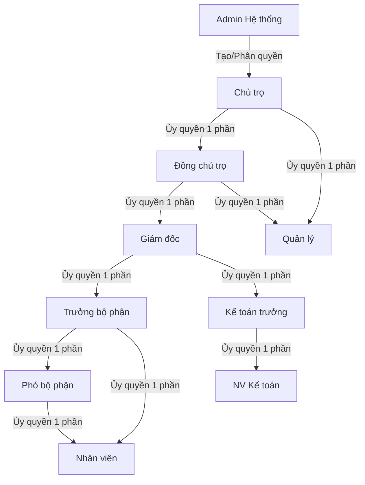
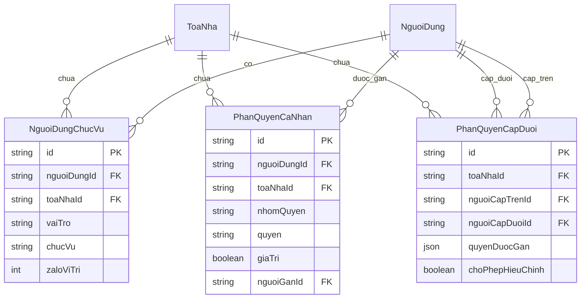
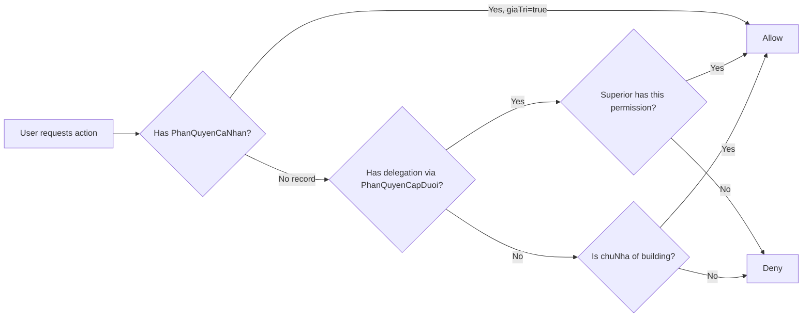

# Permission System Redesign — Tree-Based Hierarchy with Per-Person Granularity

## 1. Overview

The current permission system has several limitations:
- **Per-role, not per-person**: Permissions are assigned to roles (quanLy, nhanVien) and positions (chucVu), not to individual people
- **Flat hierarchy**: Only 3 levels (admin → chuNha → quanLy) with limited delegation
- **Business permissions via junction table**: `ToaNhaNguoiQuanLy` has hardcoded boolean columns
- **Zalo permissions via JSON blob**: `CaiDatToaNha.zaloQuyenTinhNang` stores slot-based permissions as JSON
- **No tree structure**: Cannot model "who can manage whom" or "who delegated what to whom"

### Goals

1. **Tree-based hierarchy**: Admin → Chủ trọ → Đồng chủ trọ → Giám đốc → Trưởng bộ phận → Phó bộ phận → Nhân viên
2. **Per-person permissions**: Every permission is assigned to a specific person, not a role/position
3. **Multi-position support**: One person can hold multiple positions (e.g., both kho and hành chính)
4. **Delegation chain**: Each level can delegate partial permissions to lower levels
5. **Explicit grant model**: Lower levels must be explicitly granted permissions — nothing is inherited by default
6. **Zalo monitor filters**: Integrated into Zalo permissions section, also per-person
7. **UI polish**: Rounded selectors with background color changes, smaller rounded toggles, hide business tab for managers

---

## 2. New Database Schema (Prisma Models)

### 2.1. `NguoiDungChucVu` — Person-Position Assignment

This replaces the single `chucVu` field on `NguoiDung` with a many-to-many relationship.

```prisma
// Một người có thể đảm nhiệm nhiều chức vụ
// Mỗi chức vụ gắn với một tòa nhà cụ thể
model NguoiDungChucVu {
  id          String   @id @default(cuid())
  nguoiDungId String
  nguoiDung   NguoiDung @relation(fields: [nguoiDungId], references: [id], onDelete: Cascade)
  toaNhaId    String
  toaNha      ToaNha   @relation(fields: [toaNhaId], references: [id], onDelete: Cascade)
  vaiTro      String   // chuNha | dongChuTro | quanLy | nhanVien
  chucVu      String?  // cụ thể: giamDoc, keToanTruong, truongCSKH, nvKho, leTan, etc.
  // Vị trí Zalo slot (số thứ tự trong vai trò này)
  zaloViTri   Int?     // null = không có slot Zalo

  @@unique([nguoiDungId, toaNhaId, vaiTro, chucVu])
  @@index([toaNhaId, vaiTro])
  @@index([nguoiDungId])
}
```

### 2.2. `PhanQuyenCaNhan` — Per-Person Business Permissions

This replaces the boolean columns on `ToaNhaNguoiQuanLy` with a flexible, extensible model.

```prisma
// Quyền nghiệp vụ được gán cho từng người × từng tòa nhà
// Người gán (nguoiGanId) ghi lại ai đã trao quyền này
model PhanQuyenCaNhan {
  id          String   @id @default(cuid())
  nguoiDungId String
  nguoiDung   NguoiDung @relation(fields: [nguoiDungId], references: [id], onDelete: Cascade)
  toaNhaId    String
  toaNha      ToaNha   @relation(fields: [toaNhaId], references: [id], onDelete: Cascade)
  nhomQuyen   String   // business | zalo | zaloMonitor
  quyen       String   // Tên quyền: hopDong, hoaDon, thanhToan, suCo, kichHoatTaiKhoan, botServer, trucTiep, etc.
  giaTri      Boolean  @default(true) // true = có quyền, false = không có
  nguoiGanId  String?  // ID người đã trao quyền này (để trace)
  nguoiGan    NguoiDung? @relation("NguoiGanQuyen", fields: [nguoiGanId], references: [id], onDelete: SetNull)
  ngayTao     DateTime @default(now())
  ngayCapNhat DateTime @updatedAt

  @@unique([nguoiDungId, toaNhaId, nhomQuyen, quyen])
  @@index([toaNhaId, nhomQuyen])
  @@index([nguoiDungId])
}
```

### 2.3. `PhanQuyenCapDuoi` — Delegation Chain (Who Can Manage Whom)

This models the tree hierarchy: who has the right to assign permissions to whom.

```prisma
// Quan hệ ủy quyền: người A có quyền phân quyền cho người B
// trong phạm vi một tòa nhà, với một số quyền cụ thể
model PhanQuyenCapDuoi {
  id            String   @id @default(cuid())
  toaNhaId      String
  toaNha        ToaNha   @relation(fields: [toaNhaId], references: [id], onDelete: Cascade)
  nguoiCapTrenId String  // Người trao quyền (cấp trên)
  nguoiCapTren  NguoiDung @relation("NguoiCapTren", fields: [nguoiCapTrenId], references: [id], onDelete: Cascade)
  nguoiCapDuoiId String  // Người được trao quyền (cấp dưới)
  nguoiCapDuoi  NguoiDung @relation("NguoiCapDuoi", fields: [nguoiCapDuoiId], references: [id], onDelete: Cascade)
  // Phạm vi quyền được phép phân quyền lại
  // null = toàn bộ quyền của cấp trên, JSON array = danh sách quyền được phép
  quyenDuocGan  Json?    // ["hopDong", "hoaDon"] hoặc null (tất cả)
  // Cấp độ được phép phân quyền (nếu cấp dưới được phép phân quyền tiếp)
  choPhepHieuChinh Boolean @default(true) // Cấp dưới có được chỉnh sửa quyền của cấp dưới mình không?
  ngayTao       DateTime @default(now())
  ngayCapNhat   DateTime @updatedAt

  @@unique([toaNhaId, nguoiCapTrenId, nguoiCapDuoiId])
  @@index([nguoiCapDuoiId])
  @@index([nguoiCapTrenId])
}
```

### 2.4. Migration: Keep Existing Tables (for backward compatibility)

- Keep `ToaNhaNguoiQuanLy` but mark as deprecated — new code writes to `PhanQuyenCaNhan`
- Keep `CaiDatToaNha.zaloQuyenTinhNang` but migrate to `PhanQuyenCaNhan` with `nhomQuyen: 'zalo'`
- Keep `NguoiDung.chucVu` but migrate to `NguoiDungChucVu`
- Keep `NguoiDung.zaloViTri` but migrate to `NguoiDungChucVu.zaloViTri`

---

## 3. Permission Hierarchy & Inheritance Rules

### 3.1. Tree Structure

```
Admin (hệ thống)
  └── Chủ trọ (chuNha) — chủ sở hữu tòa nhà
        ├── Đồng chủ trọ (dongChuTro) — được ủy quyền cùng quản lý
        │     ├── Giám đốc (giamDoc)
        │     │     ├── Trưởng bộ phận (truongCSKH, truongHanhChinh, truongKyThuat, thuKho)
        │     │     │     ├── Phó bộ phận (phoBoPhan, phoKT)
        │     │     │     │     └── Nhân viên (nvCSKH, nvHanhChinh, nvKyThuat, nvKho, leTan)
        │     │     └── Kế toán trưởng (keToanTruong)
        │     │           └── Nhân viên kế toán (nvKeToan)
        │     └── Quản lý kiểm toán bộ (quanLyKiemToanBo)
        │           └── Nhân viên kiểm toán bộ (nhanVienKiemToanBo)
        └── Quản lý (quanLy) — vị trí cũ, giữ để tương thích
              └── Nhân viên (nhanVien)
```

### 3.2. Permission Inheritance Rules

| Level | Can Manage | Can Delegate | Default Permissions |
|-------|-----------|--------------|-------------------|
| Admin | All roles | All permissions | Full access to everything |
| Chủ trọ | Đồng chủ trọ, Quản lý, Nhân viên | All business + Zalo permissions | Full access to own buildings |
| Đồng chủ trọ | Giám đốc, Quản lý, Nhân viên | All except quản lý chủ trọ | Same as chủ trọ but cannot manage chủ trọ |
| Giám đốc | Trưởng bộ phận, Phó bộ phận, Nhân viên | Only what được trao quyền | Only what được cấp trên trao |
| Trưởng bộ phận | Phó bộ phận, Nhân viên trong bộ phận mình | Only what được trao quyền | Only what được cấp trên trao |
| Phó bộ phận | Nhân viên trong bộ phận mình | Only what được trao quyền | Only what được cấp trên trao |
| Nhân viên | None | None | Only what được cấp trên trao |

### 3.3. Key Rules

1. **Per-person, not per-position**: If 3 people are all "Trưởng bộ phận", each gets individual permissions
2. **Explicit grant**: Nothing is inherited. Each person must be explicitly granted each permission
3. **Delegation trace**: `PhanQuyenCapDuoi.nguoiCapTrenId` records who delegated what
4. **Cannot exceed superior**: A person cannot have more permissions than their superior granted them
5. **Multi-position**: A person in both "kho" and "hành chính" roles gets the union of both positions' permissions
6. **Building-scoped**: All permissions are per-building

---

## 4. API Routes Design

### 4.1. New API Routes

| Method | Route | Purpose |
|--------|-------|---------|
| GET | `/api/admin/phan-quyen/ca-nhan?toaNhaId=xxx&nguoiDungId=yyy` | Get all permissions for a person in a building |
| PUT | `/api/admin/phan-quyen/ca-nhan` | Set/update a person's permission (body: `{ nguoiDungId, toaNhaId, nhomQuyen, quyen, giaTri }`) |
| GET | `/api/admin/phan-quyen/cap-duoi?toaNhaId=xxx` | Get delegation tree for a building |
| PUT | `/api/admin/phan-quyen/cap-duoi` | Create/update delegation relationship |
| DELETE | `/api/admin/phan-quyen/cap-duoi` | Remove delegation relationship |
| GET | `/api/admin/phan-quyen/cay?toaNhaId=xxx` | Get full permission tree for a building |
| GET | `/api/admin/phan-quyen/nguoi-dung-chuc-vu?toaNhaId=xxx` | Get all person-position assignments |
| PUT | `/api/admin/phan-quyen/nguoi-dung-chuc-vu` | Assign a person to a position |
| DELETE | `/api/admin/phan-quyen/nguoi-dung-chuc-vu` | Remove a person from a position |
| GET | `/api/admin/phan-quyen/zalo-monitor?toaNhaId=xxx&nguoiDungId=yyy` | Get Zalo monitor filter permissions |
| PUT | `/api/admin/phan-quyen/zalo-monitor` | Set Zalo monitor filter permissions |

### 4.2. Modified API Routes

| Method | Route | Change |
|--------|-------|--------|
| GET | `/api/admin/users` | Add `chucVus: NguoiDungChucVu[]` (array, not single) to response |
| POST | `/api/admin/users` | Accept `chucVus: { toaNhaId, vaiTro, chucVu }[]` instead of single `chucVu` |
| PUT | `/api/admin/users/[id]/quyen` | Deprecated — redirect to `/api/admin/phan-quyen/ca-nhan` |
| GET | `/api/admin/zalo-quyen` | Keep for backward compat, but new data reads from `PhanQuyenCaNhan` |
| PUT | `/api/admin/zalo-quyen` | Keep for backward compat, but new data writes to `PhanQuyenCaNhan` |

### 4.3. Response Shapes

**GET `/api/admin/phan-quyen/cay?toaNhaId=xxx`** — The main tree endpoint:

```json
{
  "ok": true,
  "tree": {
    "chuNha": [
      {
        "nguoiDungId": "id1",
        "ten": "Chủ trọ A",
        "chucVu": null,
        "positions": [{ "vaiTro": "chuNha", "chucVu": null, "zaloViTri": 1 }],
        "permissions": {
          "business": { "hopDong": true, "hoaDon": true, "thanhToan": true, "suCo": true, "kichHoatTaiKhoan": true },
          "zalo": { "botServer": true, "trucTiep": true, ... },
          "zaloMonitor": { "dmFilter": "system_only", "groupWhitelist": ["..."] }
        },
        "capDuoi": {
          "dongChuTro": [
            {
              "nguoiDungId": "id2",
              "ten": "Đồng chủ trọ B",
              "chucVu": null,
              "positions": [...],
              "permissions": { ... },
              "capDuoi": {
                "giamDoc": [...],
                "quanLy": [...]
              }
            }
          ],
          "quanLy": [...]
        }
      }
    ]
  }
}
```

---

## 5. UI Components Design

### 5.1. New Components

#### `tree-permission-view.tsx`
- **Purpose**: Visual tree view of the permission hierarchy
- **Features**:
  - Expandable/collapsible tree nodes
  - Each node shows: avatar, name, position badges, permission summary
  - Click to expand shows detailed permission panel
  - Drag-and-drop to reassign delegation (future)
- **Props**: `tree: TreeNode[]`, `canEdit: boolean`, `onPermissionChange: (userId, permission, value) => void`, `onDelegate: (userId, targetUserId, permissions) => void`

#### `permission-toggle.tsx`
- **Purpose**: Smaller, rounded toggle switch for permissions
- **Features**:
  - Smaller than shadcn Switch (24px instead of 40px)
  - Rounded pill shape
  - Background color changes: green when on, gray when off
  - Disabled state with opacity
- **Props**: `checked: boolean`, `disabled?: boolean`, `onChange: (checked: boolean) => void`, `size?: 'sm' | 'md'`

#### `person-selector.tsx`
- **Purpose**: Select a person from a list with search
- **Features**:
  - Search by name, email, phone
  - Shows avatar + name + position badges
  - Rounded selection with background color change
  - Multi-select support
- **Props**: `people: PersonOption[]`, `value: string | string[]`, `onChange: (value: string | string[]) => void`, `multiple?: boolean`, `placeholder?: string`

#### `position-multi-select.tsx`
- **Purpose**: Assign multiple positions to a person
- **Features**:
  - Grouped by role (quanLy, nhanVien)
  - Checkbox list with rounded styling
  - Shows current assignments
- **Props**: `positions: PositionOption[]`, `value: string[]`, `onChange: (value: string[]) => void`, `disabled?: boolean`

### 5.2. Modified Components

#### `pill-tabs.tsx` — Already done, no changes needed

#### `permission-grid.tsx` — Add support for:
- Tree-based grouping (by permission category)
- Per-person mode (show person name + permissions)
- Zalo monitor filter integration

---

## 6. PhanQuyen Page Redesign

### 6.1. Layout

```
┌─────────────────────────────────────────────────────────┐
│ PageHeader: "Phân quyền"  [BuildingSelector]  [Refresh] │
├─────────────────────────────────────────────────────────┤
│ PillTabs: [Cây phân quyền] [Quyền nghiệp vụ] [Zalo] [Giới hạn] │
├─────────────────────────────────────────────────────────┤
│                                                         │
│  Tab 1: Cây phân quyền (TREE VIEW) — DEFAULT           │
│  ┌─────────────────────────────────────────────────┐   │
│  │ 🌳 Chủ trọ A                                    │   │
│  │  ├── 👤 Đồng chủ trọ B                          │   │
│  │  │    ├── 👤 Giám đốc C                         │   │
│  │  │    │    ├── 👤 Trưởng CSKH D                 │   │
│  │  │    │    │    ├── 👤 Phó BP E                 │   │
│  │  │    │    │    └── 👤 NV F                     │   │
│  │  │    │    └── 👤 Trưởng KT G                  │   │
│  │  │    └── 👤 Quản lý H                         │   │
│  │  └── 👤 Quản lý I                              │   │
│  └─────────────────────────────────────────────────┘   │
│                                                         │
│  Tab 2: Quyền nghiệp vụ (per-person table)              │
│  ┌─────────────────────────────────────────────────┐   │
│  │ [SearchInput]                                    │   │
│  │ ┌─────────┬────────┬────────┬────────┬────────┐ │   │
│  │ │ Tên     | HĐồng  | HĐơn   | TToán  | Sự cố  │ │   │
│  │ ├─────────┼────────┼────────┼────────┼────────┤ │   │
│  │ │ Ng Văn A│ 🔘 on  │ 🔘 on  │ 🔘 off │ 🔘 on  │ │   │
│  │ │ Tr Thị B│ 🔘 off │ 🔘 on  │ 🔘 off │ 🔘 off │ │   │
│  │ └─────────┴────────┴────────┴────────┴────────┘ │   │
│  └─────────────────────────────────────────────────┘   │
│                                                         │
│  Tab 3: Zalo (per-person + monitor filters)             │
│  ┌─────────────────────────────────────────────────┐   │
│  │ [Select vai trò ▼]                               │   │
│  │ ┌──────────────┬──────────────────────────────┐ │   │
│  │ │ Slot list     │ Permission grid for person   │ │   │
│  │ │ ┌────────────┐│ ┌─────────────────────────┐ │ │   │
│  │ │ │👤 Slot 1   ││ │ BotServer  🔘 on        │ │   │
│  │ │ │👤 Slot 2   ││ │ TrucTiep   🔘 on        │ │   │
│  │ │ │👤 Slot 3   ││ │ Proxy      🔘 off       │ │   │
│  │ │ └────────────┘│ │ ...                      │ │   │
│  │ │               │ │ ─── Zalo Monitor ───     │ │   │
│  │ │               │ │ Bộ lọc DM: [Select ▼]    │ │   │
│  │ │               │ │ Nhóm theo dõi: [...]     │ │   │
│  │ │               │ └─────────────────────────┘ │   │
│  │ └──────────────┴──────────────────────────────┘ │   │
│  └─────────────────────────────────────────────────┘   │
│                                                         │
│  Tab 4: Giới hạn vai trò (same as current)             │
│  (Hidden for quản lý users)                             │
└─────────────────────────────────────────────────────────┘
```

### 6.2. Tab Visibility Rules

| User Role | Tree Tab | Business Tab | Zalo Tab | Limits Tab |
|-----------|----------|-------------|----------|------------|
| Admin | ✅ Show | ✅ Show | ✅ Show | ✅ Show |
| Chủ trọ | ✅ Show | ✅ Show | ✅ Show | ❌ Hide |
| Đồng chủ trọ | ✅ Show | ✅ Show | ✅ Show | ❌ Hide |
| Giám đốc | ✅ Show | ❌ Hide | ✅ Show | ❌ Hide |
| Quản lý | ✅ Show | ❌ Hide | ✅ Show | ❌ Hide |
| Trưởng bộ phận | ✅ Show | ❌ Hide | ✅ Show | ❌ Hide |
| Nhân viên | ❌ No access to page | — | — | — |

### 6.3. Tree Tab (Default)

The tree tab shows the full hierarchy for the selected building. Each node:
1. Shows person name, avatar, position badges
2. Click to expand shows detailed permission panel
3. Permission panel has:
   - Business permissions (toggle switches)
   - Zalo permissions (toggle switches)
   - Zalo monitor filters (select + group whitelist)
   - "Phân quyền cho cấp dưới" button (if user has delegation rights)
4. Add person button at each level to assign new people

### 6.4. Business Permissions Tab (Hidden for quản lý)

- Table view: rows = people, columns = permissions
- Each cell is a `permission-toggle` (small rounded switch)
- Inline editing with optimistic updates
- Search/filter by name, email, phone, position

### 6.5. Zalo Tab

- Left panel: slot list (same as current)
- Right panel: permission grid for selected person
- **NEW**: Zalo monitor filter section at the bottom of the permission grid
  - DM Filter: `none` | `system_only` (select)
  - Group whitelist: multi-select of monitored groups
- Per-person: each person in a slot gets their own filter settings

### 6.6. Limits Tab (Admin only)

- Same as current implementation
- Global limits + per-building limits
- No changes needed

---

## 7. UI Polish Details

### 7.1. Rounded Selectors

Current `<Select>` components use default shadcn styling. Changes:
- `SelectTrigger`: Add `rounded-full` class
- When selected: `bg-blue-50 border-blue-300`
- When not selected: `bg-white border-gray-200`
- Hover: `hover:bg-gray-50`

```tsx
// Updated SelectTrigger styling
<SelectTrigger className="rounded-full data-[state=open]:bg-blue-50 data-[state=open]:border-blue-300">
```

### 7.2. Background Color Changes on Selection

All interactive elements (buttons, selects, tabs, slots) should show background color changes:
- **Default**: `bg-white` or `bg-gray-50`
- **Hover**: `bg-gray-100`
- **Selected/Active**: `bg-blue-50 border-blue-200`
- **Disabled**: `bg-gray-100 opacity-60`

### 7.3. Smaller Rounded Toggle Switches

Create a custom `permission-toggle` component that is:
- 24px wide (vs 40px default Switch)
- Fully rounded (pill shape)
- Green when on, gray when off
- Smooth transition animation

```tsx
// permission-toggle.tsx concept
<button
  className={cn(
    'relative inline-flex h-5 w-9 items-center rounded-full transition-colors',
    checked ? 'bg-green-500' : 'bg-gray-300',
    disabled && 'opacity-50 cursor-not-allowed'
  )}
  onClick={() => !disabled && onChange(!checked)}
>
  <span className={cn(
    'inline-block h-4 w-4 transform rounded-full bg-white transition-transform',
    checked ? 'translate-x-[18px]' : 'translate-x-[2px]'
  )} />
</button>
```

### 7.4. Hide Business Tab for Managers

In the `PillTabs` configuration, conditionally filter out the business tab:

```tsx
const TAB_ITEMS = [
  { value: 'tree', label: 'Cây phân quyền', icon: GitBranch },
  ...(canEditBusiness ? [{ value: 'business', label: 'Quyền nghiệp vụ', icon: Shield }] : []),
  { value: 'zalo', label: 'Quyền Zalo', icon: Building2 },
  ...(isAdmin ? [{ value: 'limits', label: 'Giới hạn vai trò', icon: SlidersHorizontal }] : []),
];
```

Where `canEditBusiness = isAdmin || isChuNha || isDongChuTro`.

---

## 8. Migration Strategy

### 8.1. Phase 1: Schema Migration (Backend)

1. Create new Prisma models: `NguoiDungChucVu`, `PhanQuyenCaNhan`, `PhanQuyenCapDuoi`
2. Run `npx prisma migrate dev --name permission-system-v2`
3. Create migration script to populate new tables from old data:
   - `NguoiDungChucVu`: For each `NguoiDung` with `chucVu`, create a record per `toaNhaQuanLy`
   - `PhanQuyenCaNhan`: For each `ToaNhaNguoiQuanLy` row, create records with `nhomQuyen: 'business'`
   - `PhanQuyenCaNhan`: For each `CaiDatToaNha.zaloQuyenTinhNang`, create records with `nhomQuyen: 'zalo'`

### 8.2. Phase 2: API Routes (Backend)

1. Create new API routes (see section 4.1)
2. Modify existing routes to support both old and new data models
3. Add migration endpoint to sync old data to new tables

### 8.3. Phase 3: UI Components (Frontend)

1. Create `permission-toggle.tsx` — smaller rounded switch
2. Create `tree-permission-view.tsx` — tree visualization
3. Create `person-selector.tsx` — person search/select
4. Create `position-multi-select.tsx` — multi-position assignment

### 8.4. Phase 4: PhanQuyen Page Rewrite (Frontend)

1. Rewrite `phan-quyen/page.tsx` with new tabs and tree view
2. Implement per-person permission editing
3. Integrate Zalo monitor filters into Zalo tab
4. Apply UI polish (rounded selectors, background colors, smaller toggles)

### 8.5. Phase 5: Cleanup

1. Remove deprecated code after migration verified
2. Update user creation/edit forms to support multi-position
3. Update role limit checks to use new data model
4. Remove old `ToaNhaNguoiQuanLy` boolean columns (after data verified)

---

## 9. Implementation Order

### Step 1: Prisma Schema
- Add 3 new models to `schema.prisma`
- Run migration

### Step 2: API Routes
- Create `/api/admin/phan-quyen/ca-nhan` (GET + PUT)
- Create `/api/admin/phan-quyen/cap-duoi` (GET + PUT + DELETE)
- Create `/api/admin/phan-quyen/cay` (GET)
- Create `/api/admin/phan-quyen/nguoi-dung-chuc-vu` (GET + PUT + DELETE)
- Create `/api/admin/phan-quyen/zalo-monitor` (GET + PUT)
- Modify `/api/admin/users` to return `chucVus` array

### Step 3: UI Components
- `permission-toggle.tsx`
- `tree-permission-view.tsx`
- `person-selector.tsx`
- `position-multi-select.tsx`

### Step 4: PhanQuyen Page
- Rewrite with tree tab as default
- Per-person permission editing
- Zalo monitor filter integration
- UI polish (rounded selectors, background colors, smaller toggles)
- Hide business tab for managers

### Step 5: Migration Script
- Write script to populate new tables from old data
- Run on production after deployment

### Step 6: Cleanup & Testing
- Remove deprecated code
- Test all permission scenarios
- Verify backward compatibility

---

## 10. Mermaid Diagrams

### 10.1. Permission Hierarchy Flow



### 10.2. Data Model Relationships



### 10.3. Permission Check Flow



---

## 11. Risk Assessment & Mitigation

| Risk | Impact | Mitigation |
|------|--------|-----------|
| Data loss during migration | High | Keep old tables, run migration in dry-run mode first |
| Performance with deep trees | Medium | Use recursive CTE in PostgreSQL, limit tree depth |
| UI complexity for tree view | Medium | Start with simple expand/collapse, add drag-drop later |
| Backward compatibility | High | Keep old API routes working during transition |
| User confusion with new UI | Medium | Add tooltips and help text, keep old tabs available |
